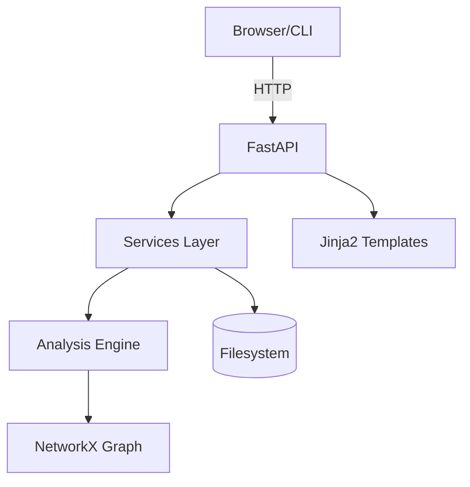

# College Prerequisite Validator AI

**A tool that validates college course prerequisite structures by converting catalogs to directed graphs and detecting structural issues like cycles, bottlenecks, and missing dependencies.**

> **Status**: MVP functional with JSON ingestion, graph analysis, REST API, and basic dashboard visualization.

---

## Table of Contents
- [Quick Start](#-quick-start-2-minutes)
- [What's Implemented](#-whats-implemented-today)
- [Data Model](#-data-model)
- [CLI Usage](#-cli-usage)
- [API Usage](#-api-usage)
- [Dashboard](#-dashboard)
- [Limitations](#-current-limitations)
- [Roadmap](#-roadmap)
- [License](#-license)

---

## 🚀 Quick Start (2 Minutes)

### Prerequisites
```bash
Python 3.11+
```

### Setup
```bash
# Clone repo
git clone https://github.com/Buddah0/Prereq-College-Validation-Ai.git
cd Prereq-College-Validation-Ai

# Install dependencies
pip install -r requirements.txt
```

### Option 1: Dashboard (Recommended)
```bash
# Start server
uvicorn app.main:app --reload

# Open browser
http://localhost:8000/dashboard
```

Select a catalog, click "Run Analysis", view issues + graph.

### Option 2: CLI
```bash
# Analyze sample catalog
python scripts/analyze.py --json samples/sample-output.json

# Generate JSON report
python scripts/analyze.py --json samples/sample-output.json --format json --out report.json
```

### Option 3: API
```bash
# Start server
uvicorn app.main:app --reload

# In another terminal:
# Upload catalog
curl -X POST http://localhost:8000/catalogs/ -F "file=@samples/sample-output.json"
# Returns: {"catalog_id": "abc123"}

# Start analysis
curl -X POST http://localhost:8000/catalogs/abc123/analyze
# Returns: {"job_id": "xyz789", "status": "queued"}

# Get report (when done)
curl http://localhost:8000/jobs/xyz789
```

Swagger UI: http://localhost:8000/docs

---

## ✅ What's Implemented Today

### Core Features
- **JSON Catalog Ingestion**
  - File upload via API
  - URL fetch (supports GitHub raw URLs)
  - **Not supported yet**: HTML scraping, PDF extraction, vendor APIs
  
- **Graph Construction**
  - Directed graph (courses → prerequisites)
  - Uses NetworkX
  - **Not supported yet**: AND/OR prerequisite logic, co-requisites

- **Validation Engine**
  - ✅ Cycle detection (finds circular prerequisites)
  - ✅ Longest prerequisite chain analysis
  - ✅ Bottleneck detection (courses required by many others)
  - ✅ Missing prerequisite detection (dangling references)
  - ✅ Isolated course detection
  - **Not implemented**: Redundancy analysis, betweenness centrality

- **Reporting**
  - JSON export (API and CLI)
  - Issue severity levels (high/medium/low)
  - Structured report format
  - **Partial**: CSV export function exists but not exposed
  - **Not implemented**: GraphML export

- **REST API**
  - OpenAPI/Swagger docs
  - Async job processing (BackgroundTasks)
  - In-memory job store with TTL
  - **Limitations**: Jobs lost on restart, no persistence

- **Dashboard** ✨
  - Interactive graph visualization (Cytoscape.js)
  - Issue table with severity indicators
  - One-click analysis workflow
  - Download JSON reports
  - **Not implemented**: Click-to-inspect courses, "what-if" simulation

---

## 📊 Data Model

### Input: Catalog JSON
```json
[
  {
    "id": "CS101",
    "name": "Intro to Computer Science",
    "prerequisites": []
  },
  {
    "id": "CS102",
    "name": "Data Structures",
    "prerequisites": ["CS101"]
  }
]
```

**Required fields**: `id`, `prerequisites` (array of course IDs)  
**Optional fields**: `name`, `description`, `credits`, etc.

### Output: Analysis Report
```json
{
  "source_path": "catalog.json",
  "generated_at": "2025-12-27T10:00:00",
  "metrics": {
    "course_count": 50,
    "num_cycles": 2,
    "longest_chain_len": 6
  },
  "issues": [
    {
      "code": "cycle",
      "severity": "high",
      "courses": ["CS101", "CS102"],
      "message": "Cycle detected involving 2 courses: CS101, CS102"
    }
  ]
}
```

### Issue Types
| Code | Severity | Description |
|------|----------|-------------|
| `cycle` | high | Circular prerequisite dependency |
| `missing_prereq` | high | Referenced course not in catalog |
| `bottleneck` | medium | Course required by 3+ others |
| `long_chain` | medium/low | Chain length > 6 courses |
| `isolated_course` | low | No prerequisites, not a prerequisite |

---

## 🖥 CLI Usage

```bash
python scripts/analyze.py --help
```

### Commands

**Full Report** (default)
```bash
python scripts/analyze.py --json samples/sample-output.json
```

**Show Statistics Only**
```bash
python scripts/analyze.py stats --json samples/sample-output.json
```

**Detect Cycles**
```bash
python scripts/analyze.py cycles --json samples/sample-output.json
```

**Show Prerequisite Chain**
```bash
python scripts/analyze.py chain --course CS301 --json samples/sample-output.json
```

**Find Unlocked Courses**
```bash
python scripts/analyze.py unlocked --completed CS101 CS102 --json samples/sample-output.json
```

**JSON Output**
```bash
python scripts/analyze.py --json samples/sample-output.json --format json --out report.json
```

---

## 🌐 API Usage

### Start Server
```bash
uvicorn app.main:app --reload
```

Swagger UI: http://localhost:8000/docs

### Endpoints

#### 1. Upload Catalog
```bash
curl -X POST http://localhost:8000/catalogs/ \
  -F "file=@catalog.json"
```

Response:
```json
{"catalog_id": "abc123", "status": "stored", "course_count": 45}
```

#### 2. Ingest from URL
```bash
curl -X POST http://localhost:8000/catalogs/ \
  -H "Content-Type: application/json" \
  -d '{"source_url": "https://raw.githubusercontent.com/user/repo/main/catalog.json"}'
```

#### 3. Start Analysis
```bash
curl -X POST http://localhost:8000/catalogs/abc123/analyze
```

Response:
```json
{"job_id": "xyz789", "status": "queued"}
```

#### 4. Check Job Status
```bash
curl http://localhost:8000/jobs/xyz789
```

Response (when done):
```json
{
  "job_id": "xyz789",
  "status": "done",
  "report_id": "rep456",
  "created_at": "2025-12-27T10:00:00",
  "updated_at": "2025-12-27T10:00:02"
}
```

#### 5. Get Report
```bash
curl http://localhost:8000/reports/rep456
```

Returns full JSON report.

### Job Lifecycle
```
queued → running → done|failed
```

**TTL**: Jobs expire after 2 hours (configurable via `JOB_TTL_SECONDS` env var)  
**Storage**: In-memory (lost on restart)

---

## � Dashboard

http://localhost:8000/dashboard

**Features**:
- Select existing catalog from dropdown
- One-click "Run Analysis" button
- Real-time job status polling
- Interactive graph visualization (Cytoscape.js)
- Issue table with severity badges
- Download JSON report

**Workflow**:
1. Upload catalog via API or select existing
2. Click "Run Analysis"  
3. Wait for completion (~1-2 seconds for typical catalogs)
4. View issues table + prerequisite graph
5. Download report

---

## ⚠ Current Limitations

### What This Tool Does NOT Do (Yet)
- **No HTML/PDF Parsing**: Catalogs must be pre-converted to JSON
- **No NLP**: Cannot parse free-form prerequisite text like "CS101 or instructor permission"
- **No Boolean Logic**: Prerequisites are simple lists, not AND/OR expressions
- **No Persistence**: Job state lost on server restart (in-memory only)
- **No Authentication**: API is open (no SSO/OAuth)
- **No Multi-Tenancy**: Single-user/institution mode
- **No SIS Integration**: No connectors for Banner/Colleague/PeopleSoft
- **No External Storage**: All data in local `data/` directory
- **No Production Queue**: Uses FastAPI BackgroundTasks (not Celery/RabbitMQ)

### Scale Limits (Current MVP)
- **Graph Size**: Tested up to ~1000 courses (NetworkX in-memory)
- **Concurrent Jobs**: Limited by single Python process
- **File Size**: 10MB max upload

---

## � Roadmap

### ✅ Completed (MVP)
- [x] JSON catalog ingestion
- [x] Graph construction (NetworkX)
- [x] Core validation algorithms (cycles, bottlenecks, chains)
- [x] REST API with async jobs
- [x] Dashboard with graph visualization
- [x] JSON report export
- [x] CLI tools

### 🚧 In Progress
- [ ] CSV export endpoint
- [ ] Enhanced dashboard UX (click-to-inspect courses)

### 🔜 Planned (Post-MVP)
- [ ] HTML/PDF catalog parsing
- [ ] AND/OR prerequisite logic
- [ ] Co-requisite support
- [ ] GraphML export
- [ ] PostgreSQL persistence
- [ ] Celery job queue
- [ ] Authentication (OAuth/SAML)
- [ ] SIS integrations (Banner, Colleague)
- [ ] Redundancy detection
- [ ] Betweenness centrality analysis
- [ ] "What-if" program simulation
- [ ] Multi-institution support

---

## � Technology Stack

**Current**:
- Python 3.11+
- FastAPI (API layer)
- NetworkX (graph algorithms)
- Jinja2 (templates)
- HTMX (dashboard interactivity)
- Cytoscape.js (graph visualization)
- Pytest (testing)
- Ruff (linting/formatting)

**Future** (when needed):
- PostgreSQL (persistence)
- Celery + Redis (job queue)
- React (richer UI)
- Neo4j (graph database at scale)
- Docker + Kubernetes (deployment)

---

## 🏗 Architecture



**Layers**:
- **API**: FastAPI routes (`/catalogs`, `/jobs`, `/reports`, `/dashboard`)
- **Services**: Business logic (`ingest_service.py`, `analyze_service.py`)
- **Engine**: Graph algorithms (`analysis_engine.py`, `topic_graph.py`, `logic.py`)
- **Storage**: Filesystem-based job store + file catalog/report storage

---

## 🧪 Testing

```bash
# Run all tests
pytest -q

# Linting
ruff check .

# Formatting
ruff format .
```

---

## 📄 License
MIT License

---

## 🤝 Contributing

This is an MVP/portfolio project. Contributions welcome but please open an issue first to discuss major changes.

**Current Focus**: Improving dashboard UX, adding CSV endpoint, testing at scale.

---

## � Contact

Project: https://github.com/Buddah0/Prereq-College-Validation-Ai
