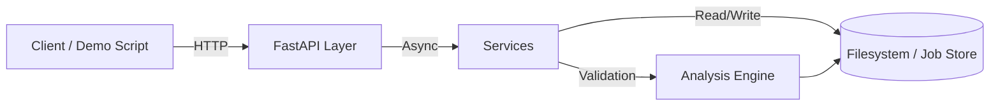

# AI Course Prerequisite Validator

A market‑relevant SaaS that converts college course catalogs into a graph model, validates prerequisite logic, and delivers actionable insights to registrars, curriculum committees, advisors, and students. The validator finds structural issues such as circular prerequisites, hidden requirements, bottlenecks, and overly long prerequisite chains, and exposes them through reports, exports, and an interactive dashboard.

Table of Contents
- Project Overview
- Ingest Usage and Quick Start
- Core Capabilities
- Data Model Summary
- API Examples
- Architecture and Technology Stack
- High Level Architecture
- Recommended Technologies
- Roadmap and Milestones
- MVP Plan 8–12 Weeks
- Post MVP Enhancements
- Go to Market Strategy
- Privacy Compliance and Operational Notes
- Getting Started and Contribution
- License

## 🚀 Overview
Purpose
Turn static course catalogs into an auditable directed graph and apply graph algorithms to validate curriculum structure, surface errors, and recommend remediation. The product reduces catalog errors, improves student planning, and helps institutions allocate resources more effectively.
Primary users
- Registrars and curriculum committees
- Academic advisors and institutional researchers
- Students (via optional planning assistant)
- Deans and department chairs

### Value proposition
- Detect impossible or inconsistent prerequisite rules before they affect students
- Reveal hidden prerequisites that inflate credit requirements
- Identify bottleneck courses and long prerequisite chains that delay graduation

---

## Ingest Usage and Quick Start
Quick usage notes for the `scripts/ingest.py` ingestion script.

Install dependencies:

```powershell
pip install -r requirements.txt
```

Run the ingester (defaults):

```powershell
python .\scripts\ingest.py
```

Specify source and output:

```powershell
python .\scripts\ingest.py --source samples/sample-catalog.html --out snapshots/latest.json
```

## Running the Analysis Demo

After ingesting data (or using the provided sample), you can run the analysis demo:

```powershell
python main.py
```

This will:
1. Load the course graph from `samples/sample-output.json`.
2. Detect and warn about any circular dependencies.
3. Show an example prerequisite chain.
4. Show unlocked courses based on a sample student history.

## Output structure:

### Example input & output

This repo includes a tiny demo catalog and its parsed output:

- Input HTML: [`samples/sample-catalog.html`](samples/sample-catalog.html)
- Output JSON: [`samples/sample-output.json`](samples/sample-output.json)

---

## Analysis CLI

The project includes a command-line interface for validating curriculum graphs.

### Validate
Run a full analysis of the curriculum graph to find issues like cycles, bottlenecks, and missing prerequisites.
```bash
python scripts/analyze.py validate --json snapshots/latest.json --out reports/report.json --csv reports/issues.csv
```

### Cycles
Quickly check for circular dependencies.
```bash
python scripts/analyze.py cycles --json snapshots/latest.json
```

### Unlocked Courses
List courses unlocked by a set of completed courses.
```bash
python scripts/analyze.py unlocked --json snapshots/latest.json --completed CS101,MATH101
```

--- 

## Core Capabilities
- Catalog Ingestion
- HTML scraping, PDF extraction, and catalog API connectors
- Configurable parsers per vendor and fallback NLP for free‑form prerequisite text
- Graph Construction
- Build directed graph G = (V, E) where nodes are courses and edges are prerequisite relationships
- Represent AND/OR logic and annotate co‑requisites without forcing cycles
- Validation Engine
- Cycle Detection using DFS or Kahn’s algorithm with cycle path reporting
- Hidden Prerequisite Detection via transitive closure against program requirements
- Longest Path Analysis to measure curriculum depth using topological ordering and DP
- Bottleneck Detection via out‑degree and betweenness centrality metrics
- Redundancy Heuristics to flag overlapping prerequisite coverage
- Reporting and Exports
- Issue lists with severity, affected courses, and remediation suggestions
- Exports: CSV, GraphML, JSON
- Interactive Dashboard
- Visual graph explorer with color‑coded issues and course drilldown
- Program simulator to preview the impact of changes
- APIs and Integrations
- REST API for ingestion, analysis jobs, and issue retrieval
- Optional connectors for SIS and degree audit systems

---

## Data Model Summary
- Course: course_id, title, level, description, credits, terms_offered
- Program: program_id, name, required_courses[], electives[]
- PrereqExpression: raw_text, expression_tree (AND/OR nodes), resolved_course_ids[]
- GraphEdge: from_course, to_course, edge_type (prereq/coreq/recommended)

## 🌐 API Mode
The project now supports a FastAPI layer for async analysis and integration.

### Quick Start
```bash
# Create and activate venv
python -m venv venv
source venv/bin/activate  # On Windows: venv\Scripts\activate

# Install dependencies
pip install -r requirements.txt

# Run server
uvicorn app.main:app --reload
```
Swagger UI: [http://localhost:8000/docs](http://localhost:8000/docs)

### API Examples

**1. Ingest via URL (GitHub Raw Support)**
```bash
curl -X POST http://localhost:8000/catalogs/ \
  -H "Content-Type: application/json" \
  -d '{"source_url": "https://raw.githubusercontent.com/Buddah0/Prereq-College-Validation-Ai/main/samples/sample-output.json"}'
```

**2. Ingest via File Upload**
```bash
curl -X POST http://localhost:8000/catalogs/ \
  -F "file=@snapshots/latest.json"
# Returns: {"catalog_id": "CAT-123", ...}
```

**3. Start Async Analysis**
```bash
curl -X POST http://localhost:8000/catalogs/CAT-123/analyze
# Returns: {"job_id": "JOB-abc", "status": "queued"}
```

**4. Poll Job Status**
```bash
curl http://localhost:8000/jobs/JOB-abc
# Returns: {"status": "done", "report_id": "REP-xyz", ...}
```

**5. Get Report**
```bash
curl http://localhost:8000/reports/REP-xyz
```

### Limitations
- **In-Memory Jobs**: Job status is stored in memory and lost on restart.
- **Job TTL**: Jobs expire after 2 hours (customizable in `.env`).
- **Storage**: Catalogs and reports are stored in `data/` directory locally.

---

## 🏗 Architecture



### High‑Level Components
- Ingestion Layer: scrapers, PDF extractor, API connectors, parsing pipeline
- Processing Layer: parser/NLP → normalizer → graph builder
- Analysis Layer: validation engine running graph algorithms and heuristics
- Storage Layer: PostgreSQL for metadata, S3 for raw snapshots, optional graph DB for scale
- API Layer: REST service exposing ingestion, job status, and analysis results
- UI Layer: React dashboard with interactive graph visualization
- Worker Queue: asynchronous job processing for heavy analyses and scheduled re‑runs

---

## 🛠 Recommended Technologies
- Backend: Python + FastAPI
- Graph Processing: NetworkX (prototype), Neo4j/TigerGraph (scale)
- Parsing: Regex + transformer models
- Frontend: React + Cytoscape.js / D3
- Queue: Celery + Redis / AWS SQS
- Database: PostgreSQL + S3
- Auth: SAML/OAuth
- Deployment: Docker + Kubernetes

---

## 🧭 Design Principles
- Idempotent ingestion
- Human‑readable explanations
- Extensible parser architecture
- Privacy by design
- Raw snapshot retention

---

## 🗺 Roadmap

### ✅ MVP (8–12 Weeks)
- Catalog ingestion prototype
- Graph builder + core analysis
- REST API
- Minimal dashboard visualization
- CSV / GraphML exports
- Pilot with one institution or sample catalog

### 🚀 Post‑MVP (3–9 Months)
- Multiple vendor parser coverage
- Advanced analytics (centrality, redundancy detection)
- Degree audit integrations
- Rules engine for institution policies
- Enterprise features (SSO, multi‑tenant)

---

## 🔒 Privacy & Compliance
If student data is used:

- FERPA alignment
- Minimal retention
- Audit logs
- Institutional ownership of records

---

## 📄 License
MIT License
